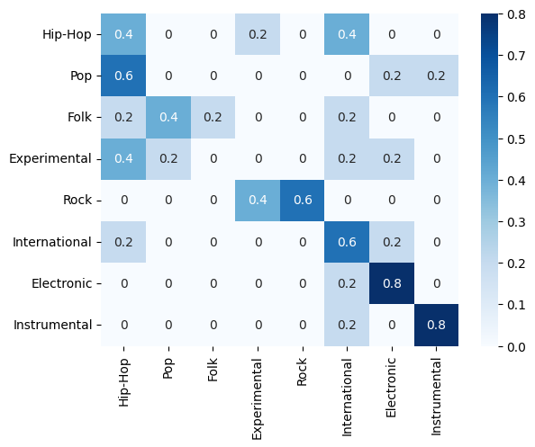
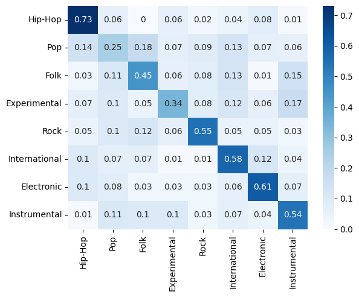

# NerualNetworksGenreClassifier

Dataset:

The dataset I collected was from Spotify. I searched for the individual genres from my original dataset on Spotify and for most genres there was a top list for songs in that genre. I would take my phone and record the song while it was playing on my computer. I collected 40 songs, 5 songs for each genre. 
There are quite a few differences when comparing these songs to the training and validation subsets. Most of the songs in the new testing dataset are much newer. Genres, overtime, may shift or contain more or less of certain audio features as music as an art evolves. Also the newer songs may be recorded on newer and better equipment which may alter the sounds of the music. 

Also, most of the songs in my new dataset are very popular, so they were likely recorded with top of the line equipment from large music labels. However, the training dataset contained all non copyrighted music which may not have been recorded on the best equipment. Also, the songs in my dataset tend to be the best songs of that genre while the original dataset songs are likely not very well liked (someone likely wouldn't make their profitable song non copyrighted). 
Recording from my phone changes the way that the music sounds. If you listen to the music you can tell it is not the original. The way that the speakers output sound and the acoustics of my room alters the sound. Not to mention, ambient sounds added noise to the recordings. There may also be other sounds added to the recording like closing doors or the creak in my chair. 

This test set is sufficient to test generalization capabilities primarily because the songs come from an entirely different database and the fact that the songs were recorded off of a phone from a computer speaker. The test set has new songs not trained on by the network. The test set songs obviously don’t even come from the same database of songs as the training songs. They were collected independently. So if the model performs well on them that likely means that the model has some generalization abilities. 

Recording off the phone effectively changes the place that the song was recorded in. We ideally want the model to know the genre of a song wherever it was recorded. The training dataset only has songs recorded in a studio. This new testing set will test whether the model can determine genre if it is not recorded in a studio. The new set was recorded in a room with very different acoustics than a recording studio designed for recording crisp music. 

Accuracy:
The model achieved:

Accuracy: 0.425

Precision: 0.4908730158730159

Recall: 0.425

F1 Score: 0.4080357142857143

Compared to validation:

Accuracy: 0.4987012987012987

Precision: 0.49141753125806853

Recall: 0.5052706822126587

F1 Score: 0.4923294353943323

Confusion Matrix test:

Confusion matrix val:

In this section I will refer to songs you can look at as examples with their index which you can listen to in the code. The place to do this for training/validation is at the top of the code and for testing it is near the bottom where it says TRYING ON DIFFERENT DATA SOURCE. I do this becauase as far as I know mp3 files are not supported in markdown.
Difference:

I think the primary reason why the testing accuracy was worse than validation has to do with the selection of songs and how genres have changed.  In the testing dataset the model didn’t get any pop or experimental correct. When I listen to the pop songs on the validation/training set, it doesn’t sound like pop music to me (song 1390). I feel as though pop may have almost been used as an other category in the original dataset. All that “pop” means when referring to the genre is that it has mainstream popularity. Not only has this likely changed in the 7 years since the dataset was created, but this also means that any pop music likely has features that might classify it into another genre. Even in the validation dataset pop was only correctly classified 25% of the time. I think it is an ill defined category. A lot of pop today has aspects of rap/hip-hop in it, so many of the pop songs in the testing data set were classified as such.

The experimental category is also very odd. In the validation/testing sets the experimental music mostly just sounds like static to me (song 1337). None of the songs in my testing dataset sound like that as the spotify experimental playlists didn’t have songs that sounded like that (testing song 24). All that experimental means as a genre is that it is pushing the boundaries of music, so an experimental song may be very close or even a part of another genre. 

The other very poor performer was folk music. I think this may be due to the way the training samples were recorded. Some of the training/validation samples for folk sound like they were recorded on old technology. The model may have picked up on that and classified it primarily based on that feature (song 1425). The testing dataset songs, however, all sound like they were recorded on new technology (testing song 4). 

Hip-hop accuracy was also down a lot and it was no longer the most accurate class. I think this likely comes from a shift in the genre. The songs in the validation/training sets are mostly old school hip-hop beats and are very obviously hip-hop (song 1335). The hip-hop songs that are popular today incorporate different sounds into the music. The genre is very new so it is evolving very quickly. They often start with an intro that doesn’t sound very hip-hop at all (testing song 34 explicit). This may cause the model to misclassify them as a different genre.

One thing to note is that a song may fall into multiple genres. Specifically for today’s hip-hop, pop, and experimental. These genres will often take from other genres, so it is not surprising that they were miscategorized a lot more in the testing set compared to the validation. Misclassified may also be a misnomer. In real life a song may be able to be classified into multiple genres, but my model does not allow for that.

Interestingly, the electronic and instrumental genres were classified better in the testing set. I think this has to do with the fact that songs on Spotify’s playlists for these genres were mostly archetypal examples of that genre (electronic test song 13, instrumental test song 5). Since these songs that were well defined in a genre were often correctly classified in the test set, it indicates that the recording method (off the phone) which added extra noise and altered the recordings may not have played a big role in lowering the overall accuracy of the model. A clearly instrumental song is still classified instrumental even if the song is recorded in a different way.

I think that model generalized fairly well, better than I was expecting. Taking out the pop and experimental genres would give the model similar overall accuracy to the validation set. 

I think a way to improve this model is by allowing songs to be classified into multiple genres. I think this is more indicative of real life. Music is an art and as such the artwork doesn’t always fall neatly into a category. For many of the misclassified pop songs, the actual output from the neural network before softmax had pop as either the second or third category
Examples (pop is index 1):
[[ 6.610549    3.403115   -4.1076264   2.8176687  -2.9998996   2.0149689
  -3.4034317   0.20214128]]
[[-4.1283426   4.2110224  -0.71162933 -3.1098342  -3.7022016   2.5848413
   5.154053    4.3674183 ]]
If the model was trained on a dataset that allowed songs to have multiple classes (and a change of architecture to allow this) it may end up with better accuracy.
